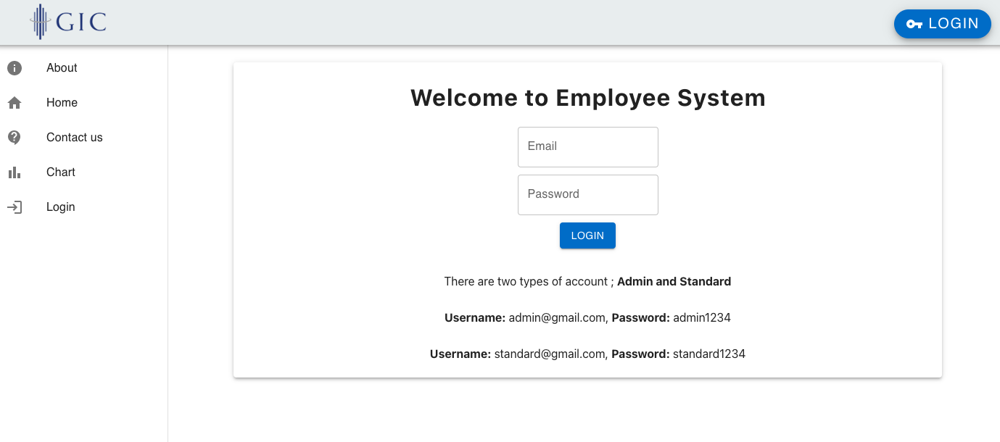
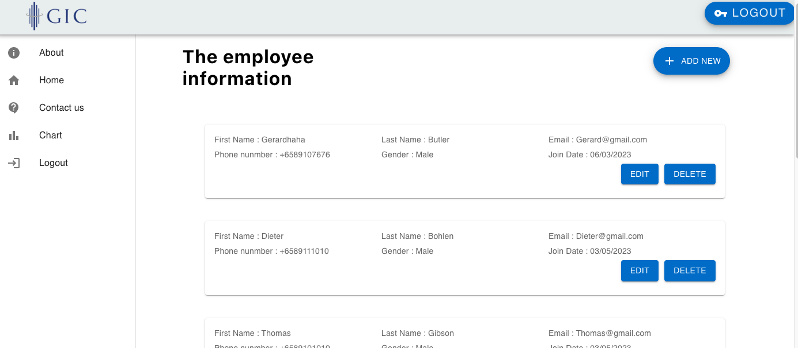
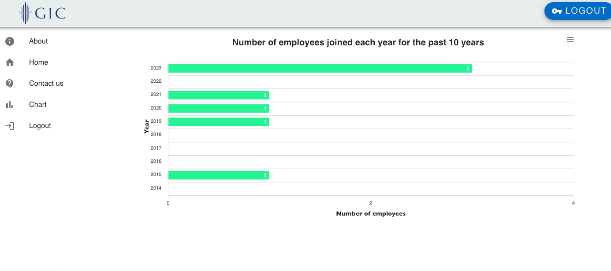

# Project - Employee manager app

   

   

   

## Project Summary

## Context:

This is a front end take home assignment for front end application dev role

## User Goal:

The aim of this assignment is to create a CRUD application that can keep track of employee's record and the year the number of employee have enrolled.

## How to start:

Please git clone the project or use gitpod to access from the web browser. Run "npm install" and follow by "npm start".

## The Back End:

The backend is a simple Node js application. User have to run the back end first before it can connect to the front end. Run "npm install", follow by "npm install -g nodemon" and lastly "nodemon
start" here is the link to [Node js Backend project ](https://github.com/henryheyhey92/employee_Backend_GIC)

[here](https://ch-api.healthhub.sg/api/public/content/2db6cc70d1974ab7843ffcfca75b4ce4?#page=17)
